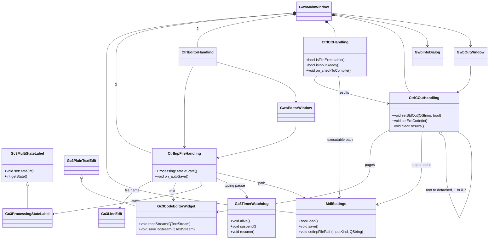

# Design

Product name: *genc³wb*

This design follows the structure defined in '02_02_design.md'.

## Applicable documents

| Ref. | Document file name | Title |
| --- | --- | --- |
| [1] | 01_01_management.md | Management requirements |
| [2] | 02_01_requirements.md | Requirements guideline |
| [3] | 02_02_design.md | Design guideline |
| [4] | 03_01_specification.md | Specification |

## Terms

The terms of the Specification [4] are used as defined there and are not redefined here. The design introduces the following terms.

| Term | Context | Definition |
| --- | --- | --- |
| *component* | Architecture overview (§ Architecture overview) | A unit of decomposition of *product*, identified by its C++ namespace and made up of the files listed for it. |
| *root output controller* | Component `genc3wb::output` | The instance of `CtrlCOutHandling` that owns the output state and forwards every change to the *detached output controllers* registered with it. |
| *detached output controller* | Component `genc3wb::output` | An instance of `CtrlCOutHandling` that presents the output in a *detached window* and receives its content from the *root output controller*. |
| *watchdog* | Component `genc3wb::widget` | A timer that expires when it has not been kept alive for a configured number of ticks, used to detect a pause in typing. |

## Scope

Covers: the components of *product*, the types and public functions they declare, the classes and their relationships, the windows with their widgets and layout, the flow of data through *product*, the representation of failure, the boundaries at which side effects occur, and the traceability from FR-001 to FR-049 of the Specification [4] to the design elements realising them.

Out of scope: the implementation of the components; the behaviour of the *compiler-compiler*; the arguments with which *product* runs it, which the Specification [4] leaves to a later version; and the format in which the settings are persisted.

## Architecture overview

| Component | Files | Responsibility | Depends on |
| --- | --- | --- | --- |
| `genc3wb::widget` | `gc3lineedit.*`, `gc3plaintextedit.*`, `gc3codeeditorwidget.*`, `gc3multistatelabel.*`, `gc3processingstatelabel.*`, `gc3timerwatchdog.*` | The reusable widgets: a line edit, a plain text edit, a code editor with line numbers, a label with several states, the *processing state* indicator, and the *watchdog*. | — |
| `genc3wb::settings` | `mdlsettings.*` | Holds the paths of the two input files, of the *compiler-compiler* and of the *output files*, and restores and stores them. | — |
| `genc3wb::inputfile` | `ctrlinpfilehandling.*` | Drives one *input group*: loading, saving, automatic saving, and the *processing state*. | `genc3wb::widget`, `genc3wb::settings` |
| `genc3wb::output` | `ctrlcouthandling.*`, `gwboutwindow.*` | Holds the standard output, the standard error, the exit code and the *output files*, presents them as *output pages*, and keeps every *detached window* of the output in step. | `genc3wb::widget`, `genc3wb::settings` |
| `genc3wb::runner` | `ctrlcchandling.*` | Determines whether the *compiler-compiler* can be run, runs it, and hands its results to `genc3wb::output`. | `genc3wb::widget`, `genc3wb::settings`, `genc3wb::output` |
| `genc3wb::editorwindow` | `ctrleditorhandling.*`, `gwbeditorwindow.*` | Presents one *input group* in a *detached window*. | `genc3wb::widget`, `genc3wb::inputfile` |
| `genc3wb::mainwindow` | `gwbmainwindow.*`, `gwbinfodialog.*`, `main.cpp` | Composes the main window from the groups, connects the controllers, and presents the info dialog. | all of the above |

The dependencies are acyclic: `widget` and `settings` depend on nothing of *product*, `inputfile` and `output` depend only on those two, `runner` adds `output`, `editorwindow` adds `inputfile`, and `mainwindow` depends on all of them and on nothing that depends on it.

`genc3wb::widget` and `genc3wb::settings` are free of any dependency on the rest of *product*, which is what makes the widgets reusable outside *product* (Coding conventions, file prefix `gc3`).

## Type declarations

```cpp
// realises FR-018, FR-019, FR-020, FR-021
/**
 * @brief The processing state of an input group.
 * @details * The order of the enumerators is the order of the images the indicator shows.
 */
enum class ProcessingState
{
    ValidFileTextUntouched,     ///< the named file exists and the text does not differ from it
    ValidFileTextChanged,       ///< the named file exists and the text differs from it
    UnknownFileTextUntouched,   ///< it is not established that the file exists, and the text was not edited since
    UnknownFileTextChanged      ///< it is not established that the file exists, and the text was edited since
};
```

```cpp
// realises FR-001
/**
 * @brief Which of the two input files an input group edits.
 */
enum class InputKind
{
    CompilerCompilerInput,  ///< the file that configures syntax and generators
    CompilerInput           ///< the file that is parsed according to that configuration
};
```

```cpp
// realises FR-027
/**
 * @brief The kind of an output page.
 */
enum class OutputPageKind
{
    StandardOutput,     ///< what the compiler-compiler wrote to standard output
    StandardError,      ///< what it wrote to standard error, with its exit code
    OutputFile          ///< the content of one output file
};
```

```cpp
// realises FR-028, FR-029, FR-040
/**
 * @brief What one run of the compiler-compiler produced.
 */
struct RunResult
{
    QString strStdOut;  ///< what the process wrote to standard output
    QString strStdErr;  ///< what the process wrote to standard error
    int     nExitCode;  ///< the exit code of the process
};
```

```cpp
// realises FR-031, FR-048, FR-049
/**
 * @brief The paths product restores between sessions.
 * @par prefix stgs
 */
class MdlSettings : public QObject
{
    Q_OBJECT

public: // constants
    static const int nMinFileNumber = 1;    ///< the number of the first output file
    static const int nMaxFileNumber = 9;    ///< the number of the last output file

protected: // attributes
    QString             m_strInpFilePath[2];    ///< indexed by InputKind
    QString             m_strCCExecFilePath;    ///< the path of the compiler-compiler
    QMap<int, QString>  m_mapOutFilePath;       ///< the path of each enabled output file, by its number
};
```

## Function signatures

### `genc3wb::settings`

```cpp
// realises FR-048
/**
 * @brief   Restores the paths stored at the last termination.
 * @return  whether the stored paths could be read
 */
virtual bool load();

// realises FR-049
/** @brief Stores the paths, to be restored at the next start. */
virtual void save();

/**
 * @brief   Yields the path of one input file.
 * @param   eKind   which input file
 * @return  the stored path, empty where none is stored
 */
virtual const QString& strInpFilePathOfKind(InputKind eKind) const;

// realises FR-012, FR-049
/**
 * @brief   Sets the path of one input file and stores it.
 * @param   eKind           which input file
 * @param   strFilePath     the path to store
 */
virtual void setInpFilePath(InputKind eKind, const QString& strFilePath);

// realises FR-024, FR-049
/** @brief Sets the path of the compiler-compiler and stores it. */
virtual void setCCExecFilePath(const QString& strFilePath);

// realises FR-031, FR-038
/**
 * @brief   Yields the path of one output file.
 * @param   nFileNumber         the number of the output file, from nMinFileNumber to nMaxFileNumber
 * @param   strOutFilePath      receives the path
 * @return  whether an output file of that number is enabled
 */
virtual bool bOutFilePathOfNumber(int nFileNumber, QString& strOutFilePath) const;

// realises FR-037
/** @brief Removes the output file of that number, so that it is no longer presented. */
virtual void excludeOutFilePath(int nFileNumber);
```

### `genc3wb::inputfile`

```cpp
// realises FR-007
/**
 * @brief   Connects the controller to the widgets of one input group.
 * @param   eKind               which input file this group edits
 * @param   pstgsSettings       the settings holding its path
 * @param   pwdgtFileName       the file name field
 * @param   pwdgtCodeEditor     the code editor
 * @param   pwdgtIndicator      the processing state indicator
 */
virtual void setup(InputKind eKind,
                   MdlSettings* pstgsSettings,
                   Gc3LineEdit* pwdgtFileName,
                   Gc3CodeEditorWidget* pwdgtCodeEditor,
                   Gc3ProcessingStateLabel* pwdgtIndicator);

// realises FR-017, FR-026
/** @brief Yields the processing state of this input group. */
virtual ProcessingState eState() const;

// realises FR-011, FR-012
/** @brief Presents a file selector dialog and writes the selected path into the file name field. */
virtual void on_selectFile();

// realises FR-013, FR-014, FR-015
/** @brief Loads the named file, asking first where the editor holds unsaved changes. */
virtual void on_fileNameChanged(const QString& strFileName);

// realises FR-019, FR-021
/** @brief Marks the text as changed and keeps the watchdog alive. */
virtual void on_textChanged();

// realises FR-016
/** @brief Saves the editor's content to the named file, on expiry of the watchdog. */
virtual void on_autoSave();

signals:
// realises FR-026
/** @brief Announces that the file or its content changed, and whether the group is ready. */
void fileOrContentChanged(bool bReady);
```

### `genc3wb::output`

```cpp
// realises FR-040
/** @brief Replaces what is shown on the standard output page. */
virtual void setStdOut(const QString& strText, bool bMakeVisible = false);

// realises FR-040
/** @brief Replaces what is shown on the standard error page. */
virtual void setStdErr(const QString& strText, bool bMakeVisible = false);

// realises FR-029, FR-040
/** @brief Replaces the exit code shown on the standard error page. */
virtual void setExitCode(int nExitCode);

// realises FR-041
/** @brief Clears the content of every output page. */
virtual void clearResults();

// realises FR-032, FR-034, FR-036
/** @brief Presents the next output page, where one follows the presented one. */
virtual void on_pushButtonRight_clicked();

// realises FR-033, FR-035, FR-036
/** @brief Presents the previous output page, where one precedes the presented one. */
virtual void on_pushButtonLeft_clicked();

// realises FR-037
/** @brief Enables or disables the output file of the presented page. */
virtual void on_checkBoxFileEnabled_clicked();

// realises FR-038, FR-039
/** @brief Presents a file selector dialog for the output file of the presented page. */
virtual void on_toolButtonFileSelector_clicked();

// realises FR-044
/**
 * @brief   Registers a detached output controller with the root output controller.
 * @param   pctrlCOutHandling   the controller to receive every later change
 */
virtual void registerHandler(CtrlCOutHandling* pctrlCOutHandling);

// realises FR-046, FR-047
/** @brief Unregisters a detached output controller, on destruction of its window. */
virtual void unregisterHandler(CtrlCOutHandling* pctrlCOutHandling);
```

### `genc3wb::runner`

```cpp
// realises FR-025
/** @brief Yields whether the file named as the compiler-compiler is executable. */
virtual bool isFileExecutable() const;

// realises FR-026
/** @brief Yields whether both input groups are in the state ValidFileTextUntouched. */
virtual bool isInputReady() const;

// realises FR-023, FR-024
/** @brief Presents a file selector dialog for an executable file. */
virtual void on_selectFile();

// realises FR-026
/** @brief Updates the readiness after a change in an input group. */
virtual void on_fileOrContentChanged(InputKind eKind, bool bReady);

// realises FR-040, FR-041
/** @brief Clears the output, runs the compiler-compiler, and hands its result to the output. */
virtual void on_checkToCompile();
```

### `genc3wb::mainwindow`

```cpp
// realises FR-003
/** @brief Presents the modal info dialog. */
virtual void on_actionInfo_triggered();

// realises FR-006
/** @brief Notifies the widget that lost the focus and the one that received it. */
virtual void on_focusChanged(QWidget* pwdgtOld, QWidget* pwdgtNow);

// realises FR-043
/** @brief Presents the output group in a detached window. */
virtual void on_detachOutput();

// realises FR-045
/** @brief Presents an input group in a detached window. */
virtual void on_detachEditor(InputKind eKind);
```

## Class diagram



## User interface design

### MainWindow

| Widget | Class | Parent | Purpose | Realises |
| --- | --- | --- | --- | --- |
| `MainWindow` | `GwbMainWindow` | | the main window | FR-001 |
| `menubar` | `QMenuBar` | `MainWindow` | the menu bar | FR-002 |
| `menuHelp` | `QMenu` | `menubar` | the help menu, carrying the info entry | FR-002, FR-003 |
| `statusbar` | `QStatusBar` | `MainWindow` | the status bar | FR-005 |
| `groupBoxCCInp` | `QGroupBox` | `MainWindow` | the group of the compiler-compiler input file | FR-001 |
| `lineEditCCInp` | `Gc3LineEdit` | `groupBoxCCInp` | its path | FR-007, FR-012, FR-013 |
| `toolButtonCCInp` | `QToolButton` | `groupBoxCCInp` | opens its file selector | FR-007, FR-011 |
| `labelIndicatorCCInp` | `Gc3ProcessingStateLabel` | `groupBoxCCInp` | its processing state | FR-007, FR-017 |
| `plainTextEditCCInp` | `Gc3CodeEditorWidget` | `groupBoxCCInp` | its text | FR-007, FR-008, FR-009 |
| `groupBoxCInp` | `QGroupBox` | `MainWindow` | the group of the compiler input file | FR-001 |
| `lineEditCInp` | `Gc3LineEdit` | `groupBoxCInp` | its path | FR-007, FR-012, FR-013 |
| `toolButtonCInp` | `QToolButton` | `groupBoxCInp` | opens its file selector | FR-007, FR-011 |
| `labelIndicatorCInp` | `Gc3ProcessingStateLabel` | `groupBoxCInp` | its processing state | FR-007, FR-017 |
| `plainTextEditCInp` | `Gc3CodeEditorWidget` | `groupBoxCInp` | its text | FR-007, FR-008, FR-009 |
| `groupBoxCC` | `QGroupBox` | `MainWindow` | the group of the compiler-compiler | FR-022 |
| `lineEditCC` | `Gc3LineEdit` | `groupBoxCC` | its path | FR-022, FR-024 |
| `toolButtonCC` | `QToolButton` | `groupBoxCC` | opens its file selector | FR-022, FR-023 |
| `labelIndicatorCC` | `Gc3ProcessingStateLabel` | `groupBoxCC` | whether it can be run | FR-022, FR-026 |
| `groupBoxCOut` | `QGroupBox` | `MainWindow` | the output group | FR-027 |
| `pushButtonLeft` | `QPushButton` | `groupBoxCOut` | presents the previous page | FR-033, FR-035 |
| `pushButtonRight` | `QPushButton` | `groupBoxCOut` | presents the next page | FR-032, FR-034 |
| `labelPage` | `QLabel` | `groupBoxCOut` | which page of how many is presented | FR-036 |
| `pushButtonCOut` | `QPushButton` | `groupBoxCOut` | detaches the output group | FR-043 |
| `stackedWidget` | `QStackedWidget` | `groupBoxCOut` | holds the output pages | FR-027 |
| `plainTextEditStdOut` | `Gc3CodeEditorWidget` | `stackedWidget` | the standard output page | FR-028, FR-042 |
| `plainTextEditStdErr` | `Gc3CodeEditorWidget` | `stackedWidget` | the standard error page | FR-029, FR-042 |
| `lineEditExitCode` | `Gc3LineEdit` | `stackedWidget` | the exit code | FR-029 |
| `checkBoxFileEnabled` | `QCheckBox` | `stackedWidget` | enables the output file of the page | FR-030, FR-037 |
| `lineEditFileName` | `Gc3LineEdit` | `stackedWidget` | its path | FR-030, FR-039 |
| `toolButtonFileSelector` | `QToolButton` | `stackedWidget` | opens its file selector | FR-030, FR-038 |
| `plainTextEditFileOut` | `Gc3CodeEditorWidget` | `stackedWidget` | its content | FR-030, FR-042 |

```
+-- MainWindow -------------------------------------------------------------+
| [Help]                                                                    |
| +-- groupBoxCCInp -------------+ +-- groupBoxCOut ----------------------+  |
| | [lineEditCCInp      ][..CCInp]| | (<) labelPage (>)     [pushButtonCOut]| |
| | (labelIndicatorCCInp)         | | +-- stackedWidget -----------------+ | |
| | +---------------------------+ | | | plainTextEditStdOut              | | |
| | | plainTextEditCCInp        | | | | plainTextEditStdErr [lineEdit..] | | |
| | |                           | | | | [x] [lineEditFileName ][..]      | | |
| | +---------------------------+ | | |     plainTextEditFileOut         | | |
| +-------------------------------+ | +----------------------------------+ | |
| +-- groupBoxCInp --------------+  +--------------------------------------+ |
| | [lineEditCInp       ][..CInp] |  +-- groupBoxCC ----------------------+  |
| | (labelIndicatorCInp)          |  | [lineEditCC          ][toolButtonCC]| |
| | +---------------------------+ |  | (labelIndicatorCC)                 |  |
| | | plainTextEditCInp         | |  +------------------------------------+  |
| | +---------------------------+ |                                          |
| +-------------------------------+                                          |
| [statusbar]                                                                |
+---------------------------------------------------------------------------+
```

### OutWindow

| Widget | Class | Parent | Purpose | Realises |
| --- | --- | --- | --- | --- |
| `OutWindow` | `GwbOutWindow` | | a detached window of the output group | FR-043 |
| `stackedWidget` | `QStackedWidget` | `OutWindow` | the same output pages as the main window | FR-044 |
| `pushButtonLeft` | `QPushButton` | `OutWindow` | presents the previous page | FR-033 |
| `pushButtonRight` | `QPushButton` | `OutWindow` | presents the next page | FR-032 |

```
+-- OutWindow ----------------------------+
| (<) labelPage (>)                       |
| +-- stackedWidget --------------------+ |
| | the page presented in this window    | |
| +--------------------------------------+ |
+------------------------------------------+
```

### EditorWindow

| Widget | Class | Parent | Purpose | Realises |
| --- | --- | --- | --- | --- |
| `EditorWindow` | `GwbEditorWindow` | | a detached window of one input group | FR-045 |
| `lineEditFileName` | `Gc3LineEdit` | `EditorWindow` | the path of that input file | FR-045 |
| `labelIndicator` | `Gc3ProcessingStateLabel` | `EditorWindow` | its processing state | FR-045 |
| `plainTextEdit` | `Gc3CodeEditorWidget` | `EditorWindow` | its text | FR-045 |

```
+-- EditorWindow ---------------------+
| [lineEditFileName    ] (labelInd.)  |
| +---------------------------------+ |
| | plainTextEdit                   | |
| +---------------------------------+ |
+-------------------------------------+
```

### InfoDialog

| Widget | Class | Parent | Purpose | Realises |
| --- | --- | --- | --- | --- |
| `InfoDialog` | `GwbInfoDialog` | | the modal info dialog | FR-003 |
| `buttonBox` | `QDialogButtonBox` | `InfoDialog` | closes the dialog | FR-004 |

```
+-- InfoDialog ---------------+
| genc³wb                     |
| <version, author, licence>  |
|                    [ OK ]   |
+-----------------------------+
```

## Data flow

Editing an input file:

keystroke → `Gc3CodeEditorWidget` → `CtrlInpFileHandling::on_textChanged` (`ProcessingState`) → `Gc3TimerWatchdog` expiry → `CtrlInpFileHandling::on_autoSave` → file

Running the compiler-compiler:

`CtrlInpFileHandling::fileOrContentChanged` (`bool`) → `CtrlCCHandling::on_fileOrContentChanged` → `CtrlCCHandling::on_checkToCompile` → process → `RunResult` → `CtrlCOutHandling::setStdOut` / `setStdErr` / `setExitCode` → *root output controller* → every *detached output controller* → `Gc3CodeEditorWidget` of each *output page*

Restoring the paths:

file → `MdlSettings::load` → `QString` per path → the file name field of each group

## Error handling strategy

- Expected failure is represented in the return type: `MdlSettings::load` and `MdlSettings::bOutFilePathOfNumber` yield `bool`, and a path that is not stored yields an empty `QString` rather than an absent value.
- A file that cannot be read or written is not an exception of *product*: it leaves the *input group* in a state `UnknownFileTextUntouched` or `UnknownFileTextChanged`, which the indicator shows (FR-020, FR-021). The user sees the failure where it arose, in the group that caused it.
- A *compiler-compiler* that cannot be started, or that fails, is reported by its exit code and by what it wrote to standard error (FR-029). *product* does not interpret either.
- No exception crosses a component boundary. A Qt exception raised inside a component is caught in that component, and turned into the state or the return value above.

## Side-effect boundaries

| Component | Free of side effects | Performs I/O |
| --- | --- | --- |
| `genc3wb::widget` | every member function except those named opposite | `Gc3CodeEditorWidget::readStream`, `saveToStream` (streams given to them), `Gc3TimerWatchdog` (system timer) |
| `genc3wb::settings` | every accessor of a path | `load`, `save` (the settings store) |
| `genc3wb::inputfile` | `eState` | `on_selectFile`, `on_fileNameChanged`, `on_autoSave` (the file system) |
| `genc3wb::output` | `isRoot`, the accessors | `on_toolButtonFileSelector_clicked`, the reading of an *output file* |
| `genc3wb::runner` | `isInputReady` | `isFileExecutable`, `on_checkToCompile` (the file system and a process) |
| `genc3wb::editorwindow` | — | opens and closes a window |
| `genc3wb::mainwindow` | — | opens and closes windows, and `main` |

A member function that changes no observable state of its object is declared `const` (Coding conventions § Function declarations): `eState`, `isInputReady`, `isFileExecutable`, `strInpFilePathOfKind` and `bOutFilePathOfNumber` are `const`; every function of the right-hand column is not.

## Traceability

| Requirement | Realised by |
| --- | --- |
| FR-001 | `GwbMainWindow`, `InputKind`, widget tree of MainWindow |
| FR-002, FR-005 | `menubar`, `menuHelp`, `statusbar` |
| FR-003, FR-004 | `GwbInfoDialog`, `GwbMainWindow::on_actionInfo_triggered` |
| FR-006 | `GwbMainWindow::on_focusChanged` |
| FR-007 | `CtrlInpFileHandling::setup` |
| FR-008, FR-009, FR-010 | `Gc3CodeEditorWidget` — line number area, current-line highlight, focus |
| FR-011, FR-012 | `CtrlInpFileHandling::on_selectFile`, `MdlSettings::setInpFilePath` |
| FR-013, FR-014, FR-015 | `CtrlInpFileHandling::on_fileNameChanged` |
| FR-016 | `Gc3TimerWatchdog`, `CtrlInpFileHandling::on_autoSave` |
| FR-017 | `Gc3ProcessingStateLabel`, `CtrlInpFileHandling::eState` |
| FR-018 to FR-021 | `ProcessingState` |
| FR-022 | `CtrlCCHandling`, widget tree of `groupBoxCC` |
| FR-023, FR-024 | `CtrlCCHandling::on_selectFile`, `MdlSettings::setCCExecFilePath` |
| FR-025 | `CtrlCCHandling::isFileExecutable` |
| FR-026 | `CtrlCCHandling::isInputReady`, `CtrlInpFileHandling::fileOrContentChanged` |
| FR-027 | `OutputPageKind`, `stackedWidget` |
| FR-028, FR-029 | `RunResult`, `CtrlCOutHandling::setStdOut`, `setStdErr`, `setExitCode` |
| FR-030 | widget tree of the output file page |
| FR-031 | `MdlSettings::nMinFileNumber`, `MdlSettings::nMaxFileNumber` |
| FR-032, FR-034 | `CtrlCOutHandling::on_pushButtonRight_clicked` |
| FR-033, FR-035 | `CtrlCOutHandling::on_pushButtonLeft_clicked` |
| FR-036 | `labelPage`, `CtrlCOutHandling::displayCurrentPage` |
| FR-037 | `CtrlCOutHandling::on_checkBoxFileEnabled_clicked`, `MdlSettings::excludeOutFilePath` |
| FR-038 | `CtrlCOutHandling::on_toolButtonFileSelector_clicked`, `MdlSettings::bOutFilePathOfNumber` |
| FR-039 | `CtrlCOutHandling::updateFileOut` |
| FR-040 | `CtrlCCHandling::on_checkToCompile`, `CtrlCOutHandling::setStdOut`, `setStdErr`, `setExitCode` |
| FR-041 | `CtrlCOutHandling::clearResults` |
| FR-042 | `Gc3CodeEditorWidget` set read-only on every output page |
| FR-043 | `GwbOutWindow`, `GwbMainWindow::on_detachOutput` |
| FR-044 | `CtrlCOutHandling::registerHandler`, *root output controller* |
| FR-045 | `GwbEditorWindow`, `CtrlEditorHandling`, `GwbMainWindow::on_detachEditor` |
| FR-046, FR-047 | `CtrlCOutHandling::unregisterHandler`, `GwbOutWindow` destruction |
| FR-048 | `MdlSettings::load` |
| FR-049 | `MdlSettings::save`, `setInpFilePath`, `setCCExecFilePath` |
| NFR-001 to NFR-004 | the components as a whole; no single design element realises them |
| C-001 to C-004 | the components as a whole: C++ with Qt, Qt widgets, a separate process in `CtrlCCHandling`, and `genc3wb::inputfile` independent of `genc3wb::runner` |

## Open questions

- none -
